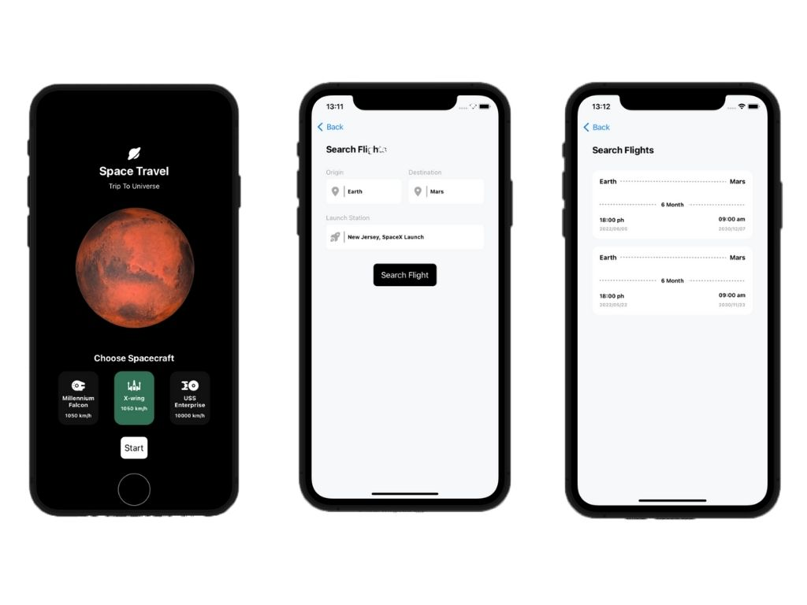

 

  <h3 align="center">Space Travel</h3>

  

    App para viagem espaciais
  

  
Índice

      <a href="#sobre-o-projeto">Sobre o projeto</a>
      <ul>
        <li><a href="#construido-com">Construido com</a></li>
      </ul>
    </li>
    <li><a href="#contato">Contato</a></li>
  </ol>

## Sobre o projeto

Esse aplicativo permite a escolha de uma nave espacial e de um destino, assim será gerado aleatoriamente uma quantidade de ticket, onde cada ticket possui sua data de partida. Já o tempo de viagem e a data de chegada no planeta escolhido é calculada de acordo com a distância do planeta e da velocidade da nave escolhida.åß

### Construído com

O projeto foi construído utilizando:

- [Swift](https://www.swift.org/)
- [RxSwift](https://github.com/ReactiveX/RxSwift)

## Contato

William James - william.james.pj@gmail.com

Link do projeto: [https://github.com/william-james-pj/SpaceTravel](https://github.com/william-james-pj/SpaceTravel)
